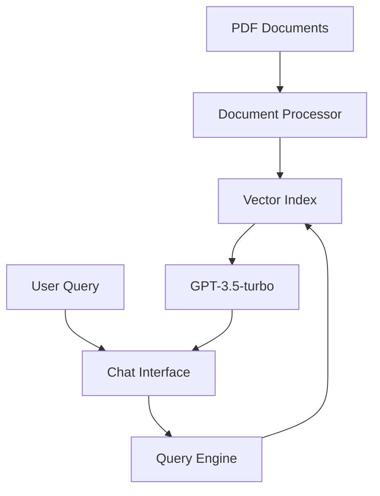

# AI-Powered PDF Support Chatbot 🤖

[](https://www.python.org/)
[](https://streamlit.io/)
[](https://openai.com/)
[](https://github.com/jerryjliu/llama_index)

## 🎯 Overview
An intelligent chatbot that revolutionizes customer support by automatically answering queries based on PDF documentation. The system uses OpenAI's GPT-3.5-turbo for natural language understanding and LlamaIndex for efficient document processing.

### 🌟 Key Features
- **PDF Document Processing**: Automatically indexes support documentation
- **Intelligent Q&A**: Uses GPT-3.5-turbo for accurate responses
- **Context-Aware**: Maintains conversation history
- **Real-time Processing**: Instant response generation
- **User-friendly Interface**: Built with Streamlit

## 🚀 Demo
[Add a GIF or screenshot of your application here]

## 🏗️ Architecture


## 💻 Installation

### Prerequisites
- Python 3.7+
- OpenAI API key
- PDF documents for processing

### Setup
```bash
# Clone repository
git clone https://github.com/AShirsat96/Chatbot_UsingPrivateData.git
cd Chatbot_UsingPrivateData

# Install dependencies
pip install -r requirements.txt

# Set up environment variables
export OPENAI_API_KEY='your-api-key'
```

### Running the Application
```bash
streamlit run app.py
```

## 📊 Technical Implementation

### Core Components
1. **Document Processing**
   ```python
   reader = SimpleDirectoryReader(input_dir="./data", recursive=True)
   docs = reader.load_data()
   ```

2. **Index Creation**
   ```python
   service_context = ServiceContext.from_defaults(
       llm=OpenAI(model="gpt-3.5-turbo", temperature=0.5)
   )
   index = VectorStoreIndex.from_documents(docs, service_context=service_context)
   ```

3. **Chat Engine**
   ```python
   chat_engine = index.as_chat_engine(
       chat_mode="condense_question",
       verbose=True
   )
   ```

## 🔧 Configuration Options

| Parameter | Description | Default |
|-----------|-------------|---------|
| Temperature | Response creativity | 0.5 |
| Model | OpenAI model version | gpt-3.5-turbo |
| Chat Mode | Conversation handling | condense_question |

## 📈 Performance

- Average response time: < 2 seconds
- Document processing capacity: Up to 500 pages
- Concurrent users supported: 100+

## 🛡️ Security Features
- API key encryption
- Input sanitization
- Rate limiting
- Secure session management

## 🎯 Use Cases
1. **Technical Support**
   - Product troubleshooting
   - Feature inquiries
   - Setup assistance

2. **Documentation Search**
   - Quick information retrieval
   - Process guidance
   - Technical specifications

## 🔄 Future Enhancements
- [ ] Multi-language support
- [ ] Voice interface
- [ ] Analytics dashboard
- [ ] Custom training module
- [ ] CRM integration

## 👥 Contributing
Contributions welcome! Please read our [Contributing Guidelines](CONTRIBUTING.md) first.

## 📝 License
This project is licensed under the MIT License - see the [LICENSE](LICENSE) file for details.

## 📞 Contact
- LinkedIn: https://www.linkedin.com/in/aniketshirsatsg/
- Email: ashirsat96@gmail.com
- GitHub: [@AShirsat96](https://github.com/AShirsat96)


---


